# Extraction of Forest Road Information from CubeSat Imagery using CNNs

## Project report and code instructions

*Lukas Winiwarter, Nicholas C. Coops, Alex Bastyr, Daisy Zhao*

IRSS, UBC Vancouver

2424 Main Mall, Vancouver, BC, V6T 1Z4, Canada.

*Adam Ford*

UBC Okanagan

**Version 2023-03-31**

> Note: This documents acts as an introduction to the method of road detection that was developed within the project.
> Here, we combine background information and runnable `Python` code. By running this embedded code, it is possible
> to either run inference using a provided pre-trained model on new data, or to train a new model provided a reference
> road dataset is given along with satellite imagery.

> Note: Please see the accompanying project report for more information on the algorithms, the results and discussion.
> A pdf version of that project report is available [here](Report%20-%20CNN%20Extraction%20of%20Forest%20Road%20Information.pdf).

## Introduction

Caribou populations have been in decline for many years due to a variety of human-caused factors, including the construction of forest roads. To properly protect and manage caribou populations, it is important to identify and map their habitats and the pathways of disturbance caused by forest roads. 

Roads act as more than linear disturbances separating two areas of closed canopies. First, they introduce and allow human access to remote areas, which would otherwise be very limited. This comes with increased human presence, leading to e.g. increased noise. Furthermore, roads allow predator movement into the caribou habitat areas. Especially Wolves take advantage of roads for fast travel, in turn threatening Caribou.

Remotely sensed satellite data can be used to map caribou habitat and to identify roads that could be having a negative impact on caribou populations. By using models that incorporate satellite data, it is possible to understand and manage the effects of roads on caribou populations and develop strategies to mitigate their impact. 

### Background

Satellite imagery is becoming available at increasing resolutions, and over large areas, with high temporal density. 
For example, PlanetLabs creates a monthly worldwide mosaic from data recorded by a network of roughly 250 miniature satellites.
The high temporal density ensures that cloud-free images can be selected in mosaicing. With common ground sampling
distances of 3-5 meters, linear features such as forest roads are well visible in the images. Especially when the 
spectral contrast to the surrounding pixels is large, as it is the case for unpaved roads in densely wooded areas,
roads can be identified easily.

In contrast, existing road data in remote areas is often poor and outdated. Furthermore, roads that have been
closed off still provide access for predators, even if human presence is reduced. Such roads may have been removed
from a dataset, as they are not considered drivable, yet continue to influence habitability.

### Method proposal

The proposed method consists of a convolutional neural network to predict the probability of a road occurring for each
pixel of the input images. The network thereby considers spatial neighbours on multiple scales to improve the predictions.
Evaluation of the classifier's performance is carried out using a buffering approach, which allows for varying road widths
and to consider spatial misalignment or inaccuracies in the digitization. Finally, the raster probabilities are
converted to a vectorized dataset which allows further analyses to be carried out. In this document, we show (a) how 
a CNN can be used to derive roads, (b) how these roads can be vectorized, and (c) how a road density layer can be calculated
from these maps.

## Installation and package requirements

The method was developed and implemented in Python, QGIS, and R. The following packages are required to run the code:

```commandline
pytorch
matplotlib
scikit-learn
tqdm
gdal (via osgeo)
ogr (via osgeo)
xarray
rioxarray
```
To set up a Python-environment with these (and a few extra) packages, you can run the following command (assuming conda has been installed):

```commandline
conda env create -f cnn_env.yml
```

To enable GPU accelerated training and inference of the CNN, `CUDA` needs to be installed. Follow the instructions [here](https://developer.nvidia.com/cuda-downloads).
While not strictly required, it is highly recommended to utilize the GPU.

For the preparation of the reference dataset and the seeds for the vectorization we use [QGIS](https://qgis.org/en/site/forusers/download.html).

In the road vectorization step, we use `vecnet` (Roussel et al., 2023, submitted). This is implemented in an [R](https://www.r-project.org/) package, which can be installed as such:
```R
install.packages('remotes', 'terra', 'sf')
remotes::install_github("Jean-Romain/vecnet")
```
## Data and data management

### Input datasets

The following datasets were considered as input to the neural network:

- RapidEye satellite imagery (2017) with 5 bands and 5 m pixel size
- Planet satellite imagery (2017) with 4 bands and 3 m pixel size
- Planet satellite imagery (2021) with 4 bands and 3 m pixel size

Furthermore, a road network layer was supplied as a shapefile. As the input dataset was supplied in tiles, a virtual raster dataset was created.

The final model was using Planet imagery from 2017 with three bands (RGB). Compared to the four-band RGBI, the difference in prediction quality is marginal, yet the runtime is significantly lower. RapidEye imagery was tested as it was used by Kearney et al. (2021) for a similar task. However, the RapidEye constellation has been discontinued since April 2020, while imagery from Planet's Dove constellation continues to be available as of 2023.

### Dataloader framework

To enable processing these different datasets, a framework for loading raster datasets was developed and implemented in `gdal_dataloader.py` in the class `RoadDataset`.
The basic idea is the following:

1. A `gdal`-compatible raster dataset with multiple bands as features is given
2. An aligned (exactly the same pixel-grid) binary raster is given as training labels (1=road, 0=no road)
   1. This raster can e.g. be created from a vector layer by using `qgis_prepare_binary_reference.model3` in QGIS. Simply
      load the vector dataset and the raster imagery, then drag+drop the QGIS model into the main window. A popup will
      appear and ask you to select input layers and provide an output path:

      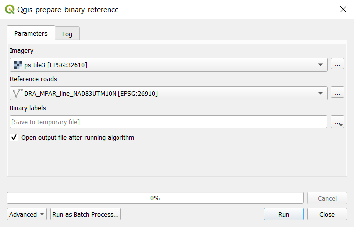
   
      Be sure to save the output to an actual file rather than a temporary layer.
   2. An alternative without QGIS would be using `gdal_rasterize`. The commands to create the dataset are
      
      ```
      gdal_create -if [feature_raster.tif] [label_raster.tif] -burn 0 -bands 1 -ot Byte
      gdal_rasterize -burn 1 -l [layername] [shapefile.shp] [label_raster.tif]
      ```
3. The framework then does a scan of the input dataset and identifies
   1. locations of 244x244 pixels where too few pixels are given as 'road' in the training labels (user defined threshold)
   2. (optional) locations outside a user-provided polygon or locations where NaN values fully cover the 244x244 pixel footprint. 
   3. (optional, when using `SplitRoadDataset`) which of the `k` spatial splits the sample belongs to (see below for details)
4. The overlap of the locations can be set by the user and is 50% by default (after selecting 244x244 pixels, the center 
   of the aoi is moved by 122 px).
5. A list of locations (ids) with valid training samples is generated.

Additionally, the `gdal_dataloader` has a function to provide a spatial split of the data into training and test/validation
data. The spatial split is created with a number of `k` folds, where the algorithm tries to make them as square as possible.
Furthermore, not all values of `k` are valid (prime numbers are not, for example). In these cases, a larger or smaller number of
folds may be created. To use this feature, load the data using the `SplitRoadDataset` rather than the `RoadDataset` class.

The value `k_split_approx` is given as a parameter when creating the dataset and internally calls `gdal_dataloader.spatial_split(k)`, which returns a list of coordinate tuples `[x_min, x_max, y_min, y_max]` for each of the approximate `k` folds.
The patches of 244x244 pixels are then assigned to each of the k folds during the data scanning.

Which of the `k` splits should be used for training/testing can be set by using the `.set_iterate_set()` function of the `SplitRoadDataset`.
Subsequent calls to `__getitem__` (as e.g. done when using a `torch.DataLoader`) will only return samples in the selected subsets (identified by their indices).

### Example code

> Note: Example data and a trained model are available as [a release on the GitHub repository](https://github.com/lwiniwar/roadCNN/releases)

The following snippet loads a raster dataset with multiple bands and one (binary) label into a `SplitRoadDataset`:

```python
from gdal_dataloader import SplitRoadDataset

train_set = SplitRoadDataset(r"planet_data.tif",
                             r"planet_data_label.tif",
                             None, k_split_approx=10, augmentation=False, 
                             overlap=122, num_channels=3, min_road_pixels=-1)
```

The first two arguments are the raster feature (multiband) and labels, the third argument is an optional shapefile.

Setting `augmentation` to `True` enables flipping and rotating the image segments to create more training data (7-times increase). The `overlap` is given in pixels
and refers to how much the window of 244x244 pixels moves with each step. We want to use a split of `k`=10, and read the first 3 channels 
(`num_channels=3`, corresponding to Red, Green, and Blue) in the input data. Further, we impose no requirement of minimum pixels classified
as road in each data sample (`min_road_pixels=-1`). Since patches with no roads present only aid little in the detection of actual roads,
setting this value >0 would increase the learning speed by skipping these patches all together and focussing on the locations where roads are,
in fact, present in the reference data.

## Network design and architecture

As a network, the _SegNet_ architecture is used (Badrinarayanan et al., 2015, [https://arxiv.org/abs/1511.00561]()).
Using an existing architecture (i.e., number of layers, size of filters, number of input bands) has the
advantage that a _pretrained_ network can be used. This speeds up training immensely, as the weights
are not initialized randomly, in which case the network would have to learn to recognize basic shapes (corners, edges, ...)
first.

_SegNet_ consists of two parts: the encoder, where spatial information is aggregated iteratively by repeated convolutional
and pooling layers in the network, and the decoder, where this information is subsequently upscaled to the original
raster, as every input pixel should be assigned exactly one output value.

For _SegNet_, the _"VGG16"_ pretrained weights can be used in the encoder part of the network. Subsequently, these 
weights are trained at half the learning rate compared to the decoder part (which is initialized randomly). This allows
the network to adapt to the different domain (VGG16 is trained on the [ImageNet](https://www.image-net.org/index.php) dataset), while still retaining information
it has learned.

### Architecture

_SegNet_ takes a (by default) 3-band raster, which is processed in patches of max. 244x244 px size. Smaller patches can
be used facultatively. A larger patch size corresponds to a larger focal area, i.e., more neighbourhood information 
available to the neural network, at a cost of a longer processing time and larger memory footprint.

The architecture of _SegNet_ is as follows:

**Encoder:**

1. Convolutional block (2 layers) with 3x3 kernel, 2x 64 filters, and ReLU activation
2. Max pooling layer with 2x2 pooling size
3. Convolutional block (2 layers) with 3x3 kernel, 2x 128 filters, and ReLU activation
4. Max pooling layer with 2x2 pooling size
5. Convolutional block (3 layers) with 3x3 kernel, 3x 256 filters, and ReLU activation
6. Max pooling layer with 2x2 pooling size
7. Convolutional block (3 layers) with 3x3 kernel, 3x 512 filters, and ReLU activation
8. Max pooling layer with 2x2 pooling size
9. Convolutional block (3 layers) with 3x3 kernel, 3x 512 filters, and ReLU activation
10. Max pooling layer with 2x2 pooling size

Each convolutional block is accopanyied by a batch normalization layer.

**Decoder:**

1. Up-sampling layer with 2x2 up-sampling size
2. Convolutional block (3 layers) with 3x3 kernel, 3x 512 filters, and ReLU activation
3. Up-sampling layer with 2x2 up-sampling size
4. Convolutional block (3 layers) with 3x3 kernel, 3x 512 filters, and ReLU activation
5. Up-sampling layer with 2x2 up-sampling size
6. Convolutional block (3 layers) with 3x3 kernel, 3x 256 filters, and ReLU activation
7. Up-sampling layer with 2x2 up-sampling size
8. Convolutional block (2 layers)with 3x3 kernel, 2x 128 filters, and ReLU activation
9. Up-sampling layer with 2x2 up-sampling size
10. Convolutional layer with 3x3 kernel, 64 filters, and ReLU activation
11. Convolutional layer with 3x3 kernel, 2 filters (corresponding to the number of output classes), and Softmax activation
12. Classification via argmax

The output of the network is a raster with two classes (road and no road) with a probability value for each class.

In the program code, the architecture is created in `SegNetModule.py`. To allow for a different number of input bands 
than 3, the user can give the number of bands as an additional argument. In the first layer, transitioning from 3 bands
by default to 64 bands, the weights of the first band (Red) are copied for all bands beyond Red, Green, and Blue. 
The assumption here is that all bands are equally able to identify basic geometric shapes, and as the weights are adapted
during training on the satellite imagery anyway, pretrained weights from either band will help. After the first layer,
no changes to the architecture are made, as it is assumed that the additional information from the added bands can be
incorporated in the existing 64 filters (corresponding to 64 bands).

### Hyperparameter tuning

The following hyperparameters were selected and tuned to their final values:

- Optimizer: Adam (Adaptive Moment Estimation) (`betas=(0.9, 0.999), weight_decay=0.0005`)
- Base learning rate: `0.0001` for the decoder, `0.00005` for the encoder
- Learning rate scheduler: decrease learning rate after each full epoch (each full pass of the training set), by a factor of 0.1 (divide by 10)
- Batch size: 16
- Number of epochs: 3

Hyperparameter tuning was not carried out systematically, but rather by selecting appropriate values from previous research
(mainly from the original _SegNet_ publication, [Badrinarayanan et al., 2015](https://arxiv.org/abs/1511.00561)) and experimenting with selected values
(the batch size, the number of epochs, and the initial learning rate) within the constraints given by system memory (64 GB),
realistic training time (< 1 week for a single experiment) and dataset size.

### Training and Evaluation

The training and evaluation of the neural network are shown in the `CNN_CV_eval.py` file. The main functions are explained here:

Assume, training data has been loaded as above (cf. Section [Data and data management](#example-code)). Using the 10
splits we have created, we want to train on splits `1-6` and `8-9`, while we keep `0` and `7` for testing. So, we first
duplicate the training set:

```python
import copy
test_set = copy.deepcopy(train_set)  # makes a copy of all elements in train_set
```

Then, we set the indices for the `iterate sets` of the respective `SplitRoadDataset`s:

```python
train_index = [1,2,3,4,5,6,8,9]
test_index = [0,7]
train_set.set_iterate_set(train_index)
test_set.set_iterate_set(test_index)
```

Next, we initialize the network. Note that this step downloads the VGG16 weights from `pytorch`, if they are not 
available in the working directory. Then, all weights are initialized randomly and the encoder weights are overwritten
by the VGG16 data. As the network needs to be adapted for a different number of input channels, it is adamant to set 
this number on initializing the neural net.

```python
from CNN_CV_eval import create_net
net = create_net(num_channels=3)
```

Before training the network, hyperparameters are defined. Here, we simply collect them in a `dict`:

```python
HP = {
   "epochs": 10,
   "base_lr": 0.0001,
   "batch_size": 16,
   "weights": [0.05, 0.95]
}
```

Here, `epochs` refers to the number of full runs through the training data that should be undertaken. `base_lr` is
the initial or base learning rate for the _ADAM_ optimizer, `batch_size` is the number of training/testing samples that
are passed through the network in a single run (decrease this value if you run into VRAM issues). Finally, `weights`
are weights passed to the loss function in order to give priority to learning roads. Errors in the _road_ class then influence
the neural network much more than errors in the _no road_ class. This is an attempt to counteract the predominance of
no-road-pixels in the training dataset.

Finally, we use the `run_single_train_test`-Function to run one set of training (for `epochs` as defined in the 
hyperparameters) and testing:

```python
from CNN_CV_eval import run_single_train_test
from pathlib import Path
run_single_train_test(train_set, test_set, net, HP, out_folder=Path('temp'))
```

The network then starts training. Example plots showing (1) an RGB representation of the current dataset, (2) the 
binary training labels, and (3) the pseudo-probability map are created every 100 iterations (with a batch size of 16,
this means every 1600th input set). Similarly, the loss curve (training loss) is plotted every 100 iterations. Here are 
examples of how these plots look like:

After 280 batches: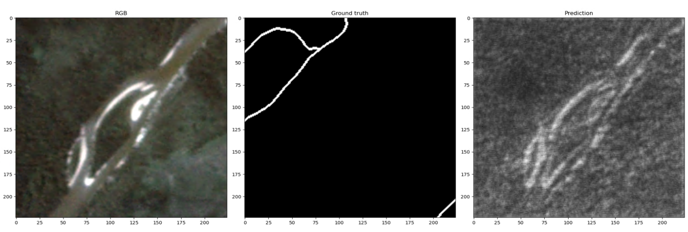

After 330 batches: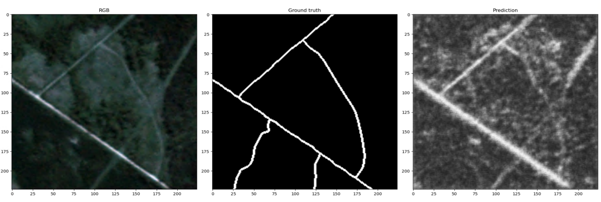

After 1 epoch (10,000 batches): 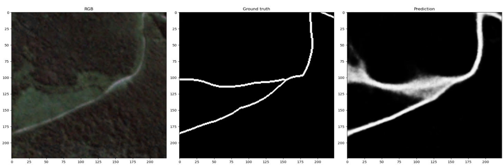

After 3 epochs (end of training): 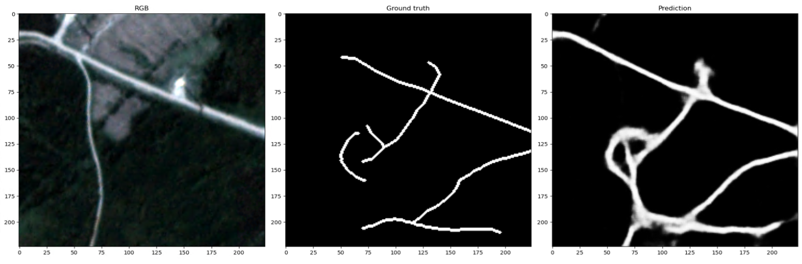

After completing a full epoch, the network weights are written to a file as backup. All files are written to the `out_folder`
directory as given above.

After finishing the last epoch, the network is switched to evaluation mode and the `test_set` data is fed through. As
the patches used as input are (typically) overlapping, most pixels (if not all) are classified multiple times. To
get one final result raster, multiple options to merge these datasets are implemented:

- `average`: Averages pseudo-probabilities over all patches a pixel is contained within
- `linear`: Same as average, but using the distance from the patch center as weights
- `flatroof`: Same as linear, but clipping weights for all points closer than `patch_size//4` to the maximum value
- `gaussian`: Same as average, but using a 2D Gaussian centered on the patch center, and with a variance of `patch_size//4` as weights
- `center`: Cutting out the center of each patch such that the concatenation of the cut-out parts makes a complete image.

   The actual size of the cut-out parts depends on the patch size and the defined overlap. Currently, this only works
   if the overlap is exactly half the patch size.

By default, the `average` method is used.

To continue training from an existing checkpoint, weights can be reloaded as follows:

```python
import torch
net.load_state_dict(torch.load(r"path/to/segnet128_final.pth"), strict=False)
```

And then running the training method as normal. To run training and testing separately (and also to use one of 
the other options for merging the overlapping test datasets), the following methods can be used:

```python
import torch

train_loader = torch.utils.data.DataLoader(train_set, batch_size=16, shuffle=True, pin_memory=True, num_workers=5)
test_loader = torch.utils.data.DataLoader(test_set, batch_size=16, shuffle=True, pin_memory=True, num_workers=5)

WEIGHTS = [0.05, 0.95]

train(net, train_loader, weights=WEIGHTS, base_lr=0.01, out_folder='temp', epochs=10)
test(net, test_loader, test_set, 'temp_test')
```

Ensure the output folders exist before attempting to write to them.

## Running inference

To simply predict roads in new (previously unseen by the network) image data, it is possible to use a pre-trained classifier. Assume a pre-trained model is available in a file `segnet128_final.pth`. Similar to above, the weights are loaded after initializing the network with the correct number of layers:

```python
import torch
from CNN_CV_eval import init_net

net = init_net(num_channels=3)
net.load_state_dict(torch.load(r"path/to/segnet128_final.pth"), strict=False)
```

Next, the dataset is specified. As we will want to run wall-to-wall predictions, we disable any subselection or augmentation, but use a 50% overlap to minimize any edge-effects.

```python
test_set = RoadDataset(
   r"E:\Data\lwiniwar\aoi_rasters\ps-tile.tif",
   r"E:\Data\lwiniwar\aoi_rasters\ps_label_notrails.tif",
   None, cache=False, augmentation=False, overlap=112, num_channels=3,
   min_road_pixels=-1, dilate_iter=1, 
   minv=[49, 155, 157], maxv=[961, 1181, 1316])

   test_loader = torch.utils.data.DataLoader(test_set, batch_size=HP['batch_size'], shuffle=False, pin_memory=True, num_workers=5)
```

Then, we can run inference on this data, and save the output to a specified directory:

```python
test(net, test_loader, test_set, Path('./output_dir'),
             merge_option=['gaussian'])
```

Here, we also specified the option `'gaussian'` for merging the overlapping tiles.

## Analysis of results

The results were analysed on two different, spatially separated test and validation datasets. The figure below shows the location 
of these subsets in the area of interest, where ID 0 was used for validation and ID 7 for testing. The other rectangular areas were employed as training data .
The red polygons show the ranges of Caribou herds in B.C. For the test- and validation area, manual editing was carried out to get a more realistic
account of roads that are detectable from satellite imagery. The human operator was given the same input imagery as
the neural network, and checked the existing road layer for consistency with the images, removing or adding road segments
as required.

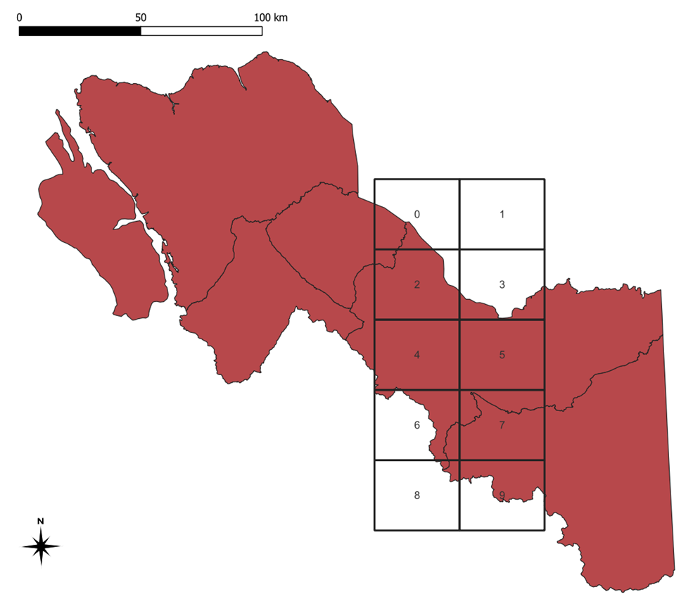

The road network was then again rasterized, and a raster-based comparison was carried out. Each pixel was assigned to one
of the classes

1. True Positive (TP): Predicted to be a road pixel by the neural network and by the human operator 
2. True Negative (TN): Not predicted to be a road pixel by the neural network nor by the human operator 
3. False Positive (FP): Predicted to be a road pixel by the neural network, but not by the human operator 
4. False Negative (FN): Not predicted to be a road pixel by the neural network, but by the human operator 

The count of these four classes was then used to evaluate four metrics:

1. Accuracy = (TP + TN) / (TP + TN + FP + FN)
2. Precision = TP / (TP + FP)
3. Recall = TP / (TP + FN)
4. F1-Score = 2 * precision * recall / (precision + recall)

The accuracy describes the total proportion of correctly classified pixels, with no consideration of the class. The
precision value explains how many of the pixels classified as road are actually road, the recall value describes
how many of the (reference) road pixels have been found by the classifier. Finally, the F1-Score is a trade-off
value between precision and recall.

### Morphological dilation

A visual interpretation showed that (a) rasterized reference data with only 1 px width did often not correspond to
the actual visible road in the imagery (which was wider than 3 m or 5 m, respectively of the dataset), as well as
some misalignment between the datasets, leading to a low performance score. As the exact location of the road (within a 
few meters) was not of importance in this study, we opted for a pragmatic approach to recalculate the performance values.

Using binary morphological operators, a buffer around pixels predicted roads was created (binary dilation). Then, 
TP, TN, FP and FN were identified. As the misalignment resulted in a number of FP on one side and FN on the other side
of each road, the regions around TP were again buffered using binary dilation. All pixels within this buffer were then
set to "no road" in both the training and the test set. This resulted in a typically 1 px wide line of TP surrounded by TN,
if both predicted and reference datasets had found road pixels within these buffers. The buffer size (a multiple of the
pixel size) was varied to find a trade-off between realistic result interpretation and allowing for multi-pixel wide 
road as well as a spatial mismatch of a few meters.

With increasing buffer size, the metrics of accuracy, precision, recall and F1-score converged to values < 100%. By looking
at the limit, an estimate of the evaluation given no spatial mismatch can be derived. This is presented below:
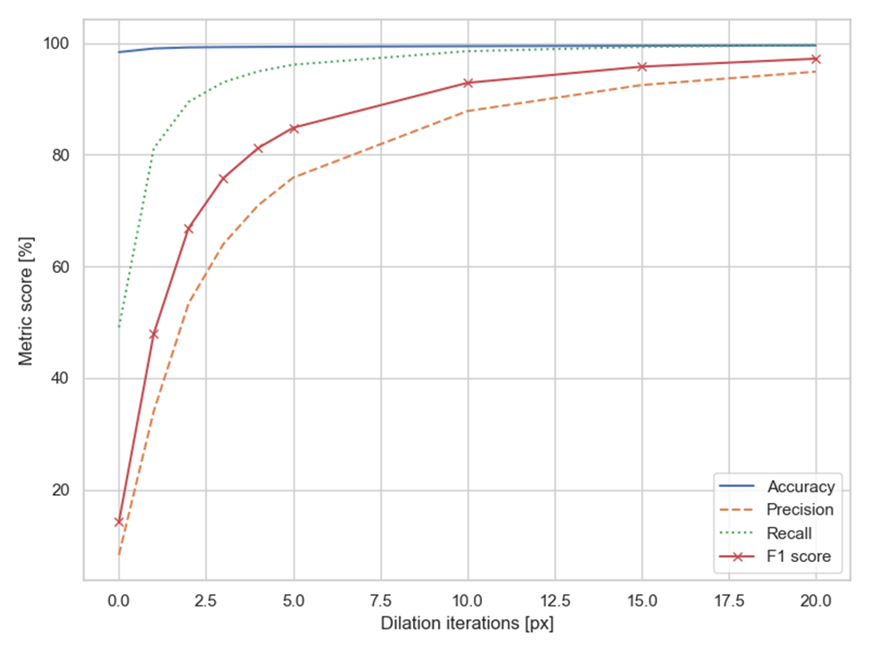

### Dependency on slope, aspect, NDVI and land cover class
To further identify areas in which the correct identification of roads is difficult, we calculate the performance metrics
stratified by 
1. topographic slope
2. topographic aspect (orientation of the slope)
3. NDVI calculated from the input RGB(I) imagery, to proxy for canopy closure/coverage,
4. land cover class

The results without and with dilation (value in parentheses) are given in the following table:

|                                                                                                                                    |     Accuracy [%]    |     Precision [%]    |     Recall [%]       |     F1 [%]          |
|------------------------------------------------------------------------------------------------------------------------------------|---------------------|----------------------|----------------------|---------------------|
| NDVI < 0                                                                                                                           |     N/A (98.6)      |     N/A (60.0)       |     N/A (100.0)      |     N/A (75.0)      |
| 0 <= NDVI < 0.5                                                                                                                    |     95.0 (97.8)     |      13.6 (68.1)     |      50.0 (88.2)     |      21.4 (76.8)    |
| 0.5 <= NDVI < 0.75                                                                                                                 |     91.7 (97.6)     |      11.5 (81.2)     |      61.7 (96.4)     |      19.4 (88.1)    |
| 0.75 <= NDVI < 1                                                                                                                   |     98.9 (99.5)     |      6.1 (74.6)      |      40.9 (96.6)     |      10.6 (84.2)    |
| Slope < 5 deg                                                                                                                      |     98.1 (99.3)     |      9.2 (79.9)      |      51.3 (96.4)     |      15.6 (87.4)    |
| 5 <= Slope < 10 deg                                                                                                                |     97.9 (99.2)     |      8.9 (79.2)      |      50.4 (96.4)     |      15.2 (86.9)    |
| 10 <= Slope < 20 deg                                                                                                               |     98.5 (99.3)     |      7.8 (73.5)      |      46.9 (95.8)     |      13.4 (83.2)    |
| 20 <= Slope < 30 deg                                                                                                               |     99.1 (99.4)     |      5.0 (54.8)      |      38.9 (93.9)     |      8.8 (69.2)     |
| 30 <= Slope                                                                                                                        |     99.3 (99.4)     |      1.7 (25.6)      |      24.9 (90.2)     |      3.2 (39.9)     |
| Aspect: North                                                                                                                      |     98.2 (99.3)     |      8.5 (75.9)      |      47.6 (95.7)     |      14.4 (84.7)    |
| Aspect: East                                                                                                                       |     98.3 (99.3)     |      8.7 (77.2)      |      51.6 (96.5)     |      15.0 (85.8)    |
| Aspect: South                                                                                                                      |     98.4 (99.4)     |      8.5 (77.0)      |      51.4 (96.5)     |      14.6 (85.6)    |
| Aspect: West                                                                                                                       |     98.5 (99.4)     |      7.9 (74.4)      |      48.3 (96.1)     |      13.6 (83.9)    |
| LC: 20 (Water)                                                                                                                     |     99.5 (99.6)     |      1.0 (23.1)      |      40.6 (100.0)    |      1.9 (37.5)     |
| LC: 31 (Snow/ICE)                                                                                                                  |     98.2 (98.9)     |      5.1 (55.4)      |      54.5 (97.5)     |      9.3 (70.7)     |
| LC: 32 (Rock/rubble)                                                                                                               |     98.0 (98.1)     |      0.0 (4.0)       |      1.0 (64.9)      |      0.1 (7.5)      |
| LC: 33 (Exposed/Barren   land)                                                                                                     |     96.0 (98.0)     |      6.6 (67.0)      |      28.2 (88.0)     |      10.8 (76.1)    |
| LC: 50 (Shrubs)                                                                                                                    |     94.4 (98.5)     |      10.2 (86.3)     |      55.4 (97.4)     |      17.3 (91.5)    |
| LC: 80 (Wetland)                                                                                                                   |     97.1 (99.0)     |      9.8 (80.3)      |      66.9 (98.5)     |      17.1 (88.5)    |
| LC: 81 (Wetland-treed)                                                                                                             |     98.2 (98.8)     |      4.3 (53.9)      |      60.1 (99.2)     |      8.0 (69.8)     |
| LC: 100 (HERBS)                                                                                                                    |     92.0 (98.6)     |      12.0 (91.8)     |      56.7 (97.4)     |      19.8 (94.5)    |
| LC: 210 (CONIFEROUS)                                                                                                               |     99.2 (99.6)     |      7.1 (68.2)      |      51.4 (96.7)     |      12.5 (80.0)    |
| LC: 220 (Broadleaf)                                                                                                                |     98.1 (99.1)     |      6.9 (70.3)      |      45.7 (95.9)     |      12.0 (81.1)    |
| LC: 230 (Mixed wood)                                                                                                               |     N/A (99.9)      |     N/A (60.0)       |      N/A (75.0)      |      N/A (66.7)     |


### Calculation of performance metrics
To calculate these performance metrics, we provide the script `create_eval_bin_from_rasters.py`. Paths have to be adapted
at the end of the file, and a plot and a list of accuracies will be provided. It is possible to run the script
with or without the stratification described above. Note that the raster layers have to be aligned with the
binary road predictions, but may cover a larger area than the prediction.

## Post-processing

While the binary road raster can be used for evaluation of the classification performance, its use for further processing
is limited. We therefore derive a topologically intact vector road network using the approach presented by Roussel
et al. (2023, submitted).

The input to this algorithm is a probability map as well as starting road segments.
We use the existing road network layer we used for training/test, explode it into individual line segments, 
and intersect these with the bounding box of the test area. This results in short line segment leading into the evaluation
area. Roads that have no connection to these input features will not be present in the extracted dataset - however, they
are also not accessible from outside of this area, making them mostly unusable (exceptions might be e.g. islands or 
tunnels, or cases where the connecting road cannot be reliably detected by the CNN).

To obtain these seeds automatically, we provide the QGIS model `qgis_prepare_seeds_from_reference.model3`. As with
the previous model, load the relevant layers into QGIS (the probabilities raster and the reference roads), drag
and drop the `.model3` file into QGIS and you will be presented with a user interface:

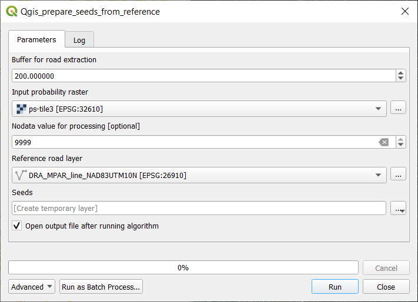

Here, the buffer size can be set, as well as a nodata value which is used during processing to determine whether the
seeds actually cover any valid pixels in the dataset. The model works best for fully populated, rectangular raster
predictions. If your area of interest is not rectangular, you might want to consider adding manual seeds.

Subsequently, the following `R` code is run to extract the roads:

```r
library(terra)
library(sf)
library(vecnet)
seeds <- st_read("seeds.shp") |> st_geometry()
map <- rast("prob_gaussian.tif")
res <- vectorize_network(map, seeds, min_conductivity=0.15, display=TRUE, threshold=0.03)
st_write(res, "result_roads.shp", append=FALSE)
```

The following parameters (selection) can be set for the road extraction:

- Minimum conductivity (`min_conductivity`)
- Threshold (`threshold`)
- View distance (step size) (`sightline`)
- Minimum length (`min_length`)

For a full explanation of the parameters, you can run the documentation in `R`: `?vectorize_network` and `?track_line`,
or visit the [documentation website](https://github.com/Jean-Romain/vecnet/tree/main/man). By setting `display=TRUE`,
a live view of the extracted roads will be shown as a plot, which may look like this:

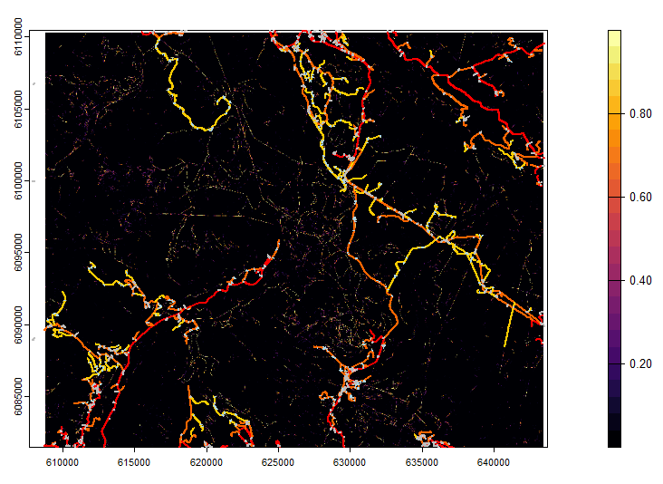

The resulting vectorized road network can be used to compute accessibility metrics, navigation, or simply act as an 
update to the existing road data.

### Large scenes
In order to process the whole scene, the dataset had to be processed in parts. 
The CNN predictions were run separately for the individual parts. As the input data files
overlapped, a full coverage of the area of interest was ensured.

In QGIS, the provided processing workflows can be executed "as a batch process", which allows 
to run the same method on multiple input/output files:
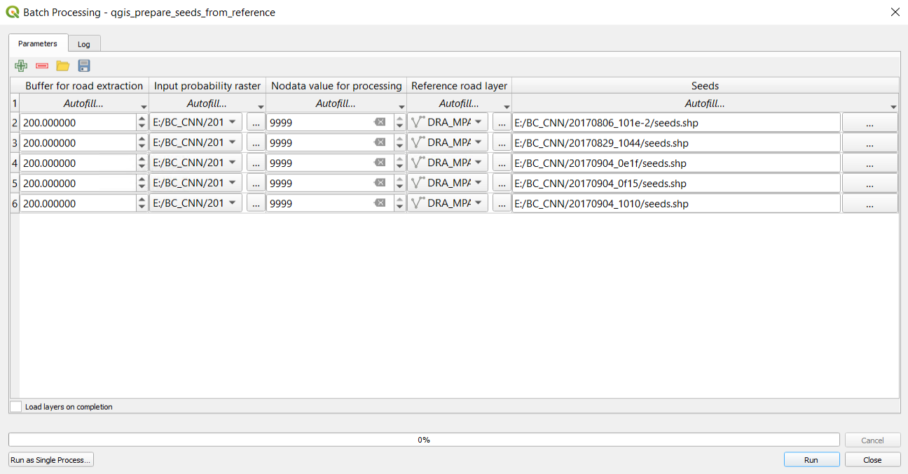

For the road extraction, the R-Script to run the vectorization was adapated to go through
the files in a loop, resulting in a number of road network files. To merge these files,
the "merge vector layers" function in QGIS was used.

## Density calculation
To present the data as a road network density map, the python script `road_density_calc.py` can be used. To run it,
import the file and run the `main`-Function:

```python
import road_density_calc
road_density_calc.main(
   r'path/to/input/file.shp',  # input vector file
   15,  # pixel size of the output map in [m]
   2000,   # search radius for the density calculation,
   r'path/to/output/file.tif'  # path to output raster file
)
```

The calculation makes use of a spatial index (R-tree) built on the input vector dataset, but may still take some time
to run for larger datasets (typically less than 1h). The output may look something like this and can be visualized in 
any GIS system:

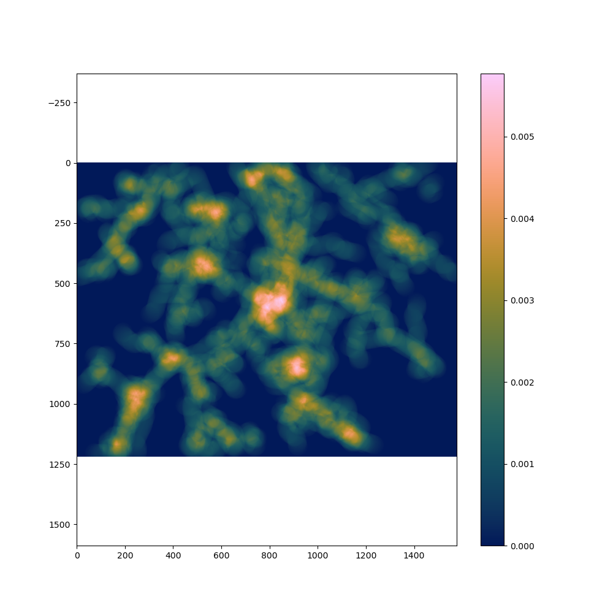

## Discussion
The CNN-based road extraction approach developed in this study and trained on Planetscope 
imagery, achieved reasonably high performance on both the paved and unpaved rural roads 
typical of the boreal regions of Canada. Recall, Precision and F1 quality metrics were 
comparable to studies using higher resolution imagery, such as Rapideye, to extract paved
roads across much smaller areas using deep learning (e.g., 
[Gao et al., 2019](https://doi.org/10.3390/rs11050552); 
[Xu et al., 2018](https://doi.org/10.3390/rs10091461))
and other approaches (e.g., 
[Miao et al., 2015](https://doi.org/10.1109/JSTARS.2015.2443552); 
[Zhou et al., 2019](https://doi.org/10.3390/rs11010079)). A key benefit of using data
from CubeSats, such as PlanetScope, is a high spatial and temporal resolution. While PlanetScope
imagery is typically available at daily or near-daily timesteps, clouds and cloud shadows
increase the revisit period which can, in cloudy areas, exceed a number of weeks (Keay et al., 2022).
In most cases this delayed temporal resolution is unlikely to cause issues, as the updating of road
information is unlikely to occur more often than a few times per year. PlanetScope data products use
anomalous brightness values to detect clouds. However, recently constructed roads with little remaining
vegetation will also have anomalous brightness values and may be misclassified as cloud, thereby reducing the
number of valid pixels from which to detect a change. With improvements in the UDM2 product and addition of new
spectral bands to PlanetScope satellites, this misclassification of clouds may be reduced 
([Keay et al., 2022]()).
In addition, while users can download PlanetScope scenes with a daily temporal revisit, Planet now offers image
composites at coarser temporal resolutions (e.g., biweekly or monthly), which typically have lower cloud cover
than that of the average scene over a given area. 

A key benefit of the approach used in this study is the use of a pre-existing training set with which to build
the initial CNN model.  The use of deep learning algorithms such as CNN has expanded greatly within the past 5 years
and advances in computing power and the ability to apply deep learning algorithms in a spatial context allows users
previously unable to utilise the power of CNN, to now be able to do so. Roads are difficult objects to classify due 
to their spectral similarity to other high albedo objects such as bare soil and rock, and their morphological similarity
to other linear features such as rivers and pipelines making a CNN approach logical to apply.

Another key outcome of the methods developed in this paper is the development of a fully connected road network,
rather than separate, discrete, road segments. Even after post-processing, a pixel-based road extraction approach
can be difficult to convert into a fully connected vectorized road network for navigation (
[Xu et al., 2018](https://doi.org/10.3390/rs10091461)
). The
approach, developed by 
Rousell et al. (2023, submitted)
and applied here, allows the detected road segments to be connected in a 
vector dataset to ensure a topologically correct road network, which is required for most applications such as road
planning, and conservation and needed in order to ingest this road information into existing vector databases.

Lastly our analysis indicates how long-term archival satellite data can be used to determine the age of forest 
roads in northern British Columbia using time series of spectral indices and annual Landsat best-available pixel 
image composites. The road age results produced from the NDVI and NBR time series are comparable, with minor variations
year to year. Both methods, however, result in road segments along a road to fluctuate in age. This fluctuation in age
is in part attributed to road segments within Landsat pixels being too small or affected by spectral noises from 
background land cover, resulting in no changes being detected. To account for this, future work will incorporate a
minimum change detection threshold. 

Up-to-date information on the rural road network is critical for the management of threatened and endangered species
and is becoming a critical piece of information to aid in conservation activities. In British Columbia, with increasing
levels of disturbance due to insect infestation, harvest, fire as well as ongoing anthropogenic disturbances associated
with exploration and mining, the density of roads across the region remains of paramount concern. Quantifying the
density of the road network within individual caribou herd ranges is one metric that can provide some context to how
much activity may be occurring within each of these caribou herd ranges. This idea is similar to that undertaken with 
the management of the grizzly bear in Alberta where the Albertian provincial government recommended road densities below 
certain thresholds to encourage recovery of the species. While these thresholds are important, it is therefore critical
that spatial coverages showing the extent of the road coverage are accurate and complete which is often not the case in 
remote areas. The technique presented here to detect roads from high spatial resolution Planet imagery, and then provide 
an indication as to their age from historic Landsat imagery, provides approaches where an accurate road network can be
built. In addition, the ability to vectorized these predictions to produce a linked road network, whilst in its infancy,
is the critical final step in ensuring these layers can then effectively be used for management.

Looking to the future, for the management potential of these types of technologies, one possible strategy would be to 
integrate GNSS data acquired from in vehicle loggers, which map the use of the landscape by vehicles, combined with 
geospatial coverages from satellite data such as demonstrated here could result in a database of both accurate road 
location information but also use. Information on the speed and diurnal use of roads could also be extracted from these
databases to provide a comprehensive analysis of the road infrastructure in an area. Whilst these types of databases are
starting to be developed within the forest industry using GNSS receivers on harvesting operations, there broader use in 
a conservation setting has not yet been fully examined and may provide additional insights into road networks 
particularly for endangered species.


## Conclusion

We successfully used a pre-trained convolutional neural network as encoder for a SegNet-based road detector on satellite
imagery data. While the use of the pre-trained weights meant that the architecture of the network was fixed, training
convergence could be achieved much faster than when using random initialization. Overall, the road detection with 
post-processing resulted in an accuracy of 99.1%, with precision and recall values of 76.1% and 91.2%, respectively. In comparison
to existing datasets, including ones that were derived from satellite imagery using CNNs, our method delivers a better
picture of the road network, since we focus on _forest roads_ specifically. 

The conversion of the raster-based road prediction to a vectorized network is non-trivial, but can be achieved to a certain
degree. If a vectorized network is required for subsequent processing, the presented approach provides a mostly automated
method, where only minimal manual effort is required to ensure consistency in the data. This report can be used as a
step-by-step guide to create such a dataset.
